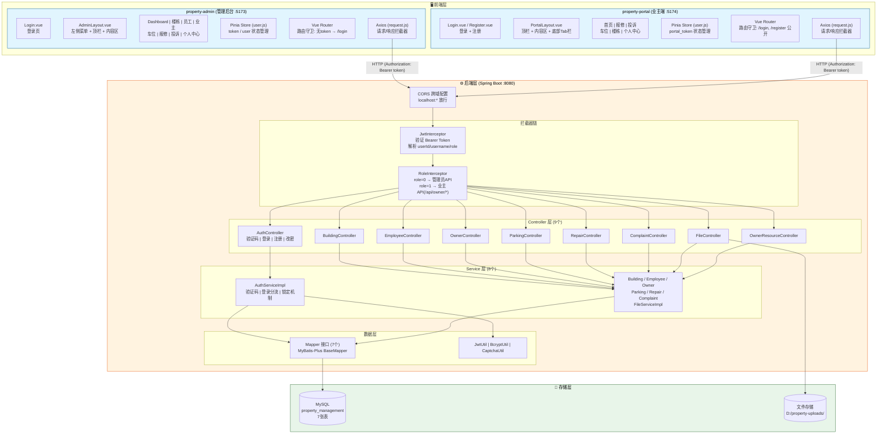
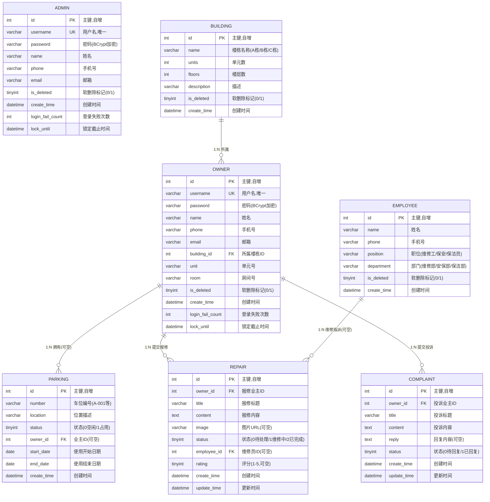
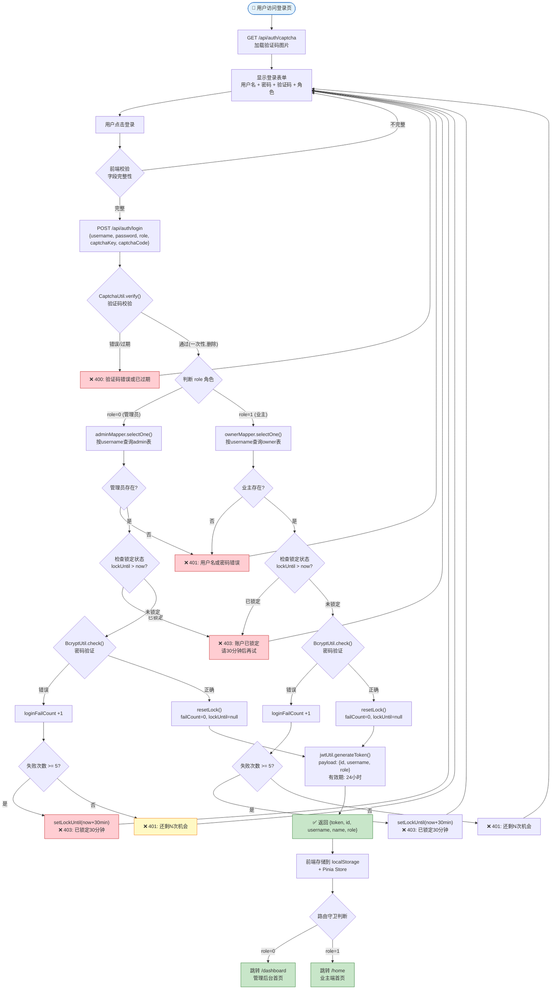
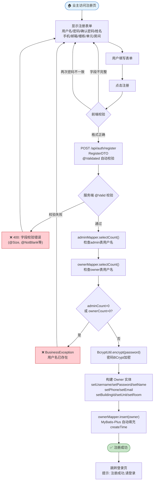
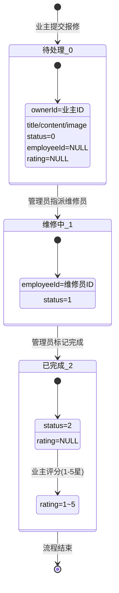
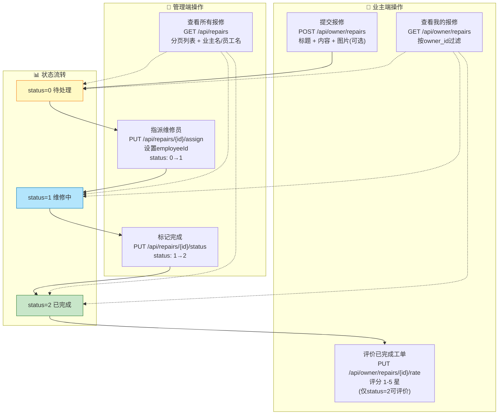
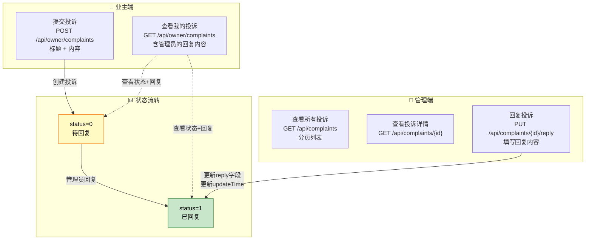
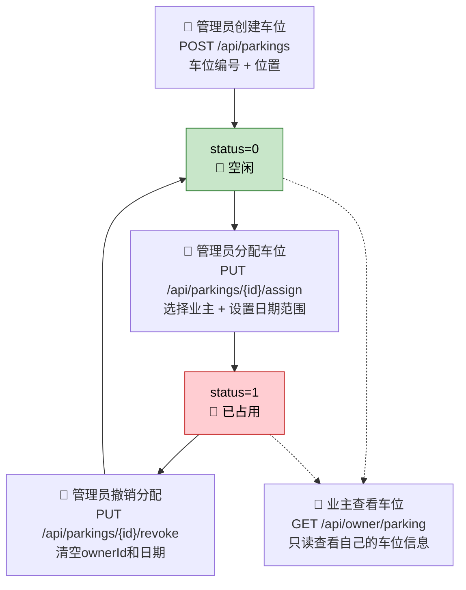
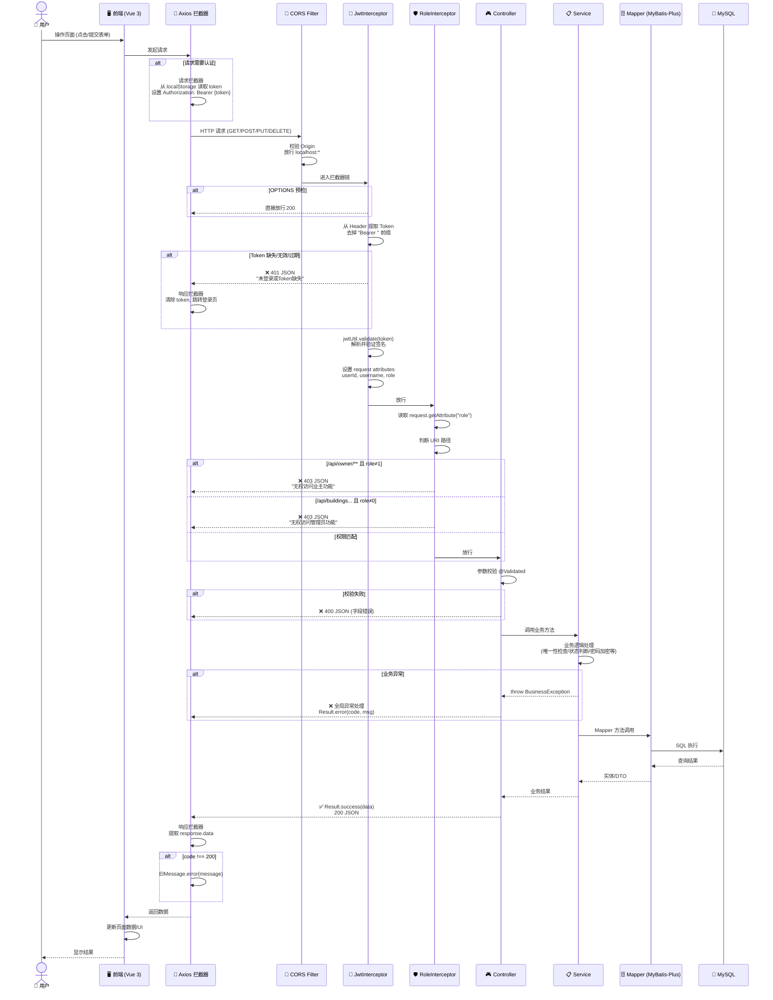

# 小区物业管理系统 — 流程图文档

> 基于 Spring Boot 3 + Vue 3 + MyBatis-Plus + MySQL 的小区物业管理系统

---

## 图 1：系统架构图



**说明：**
- **前端**：管理后台 (`property-admin`) 和业主端 (`property-portal`) 两个独立的 Vue 3 SPA 应用
- **通信**：前端通过 Axios 发送 HTTP 请求，携带 `Authorization: Bearer <JWT>` 头
- **拦截器链**：JwtInterceptor 先验证 Token → RoleInterceptor 再校验角色权限
- **数据层**：MyBatis-Plus `BaseMapper` 提供 CRUD，部分复杂查询用 `@Select` 注解
- **文件存储**：上传文件存到 `D:/property-uploads/`，通过 `/uploads/**` 虚拟路径访问

---

## 图 2：数据库 E-R 图



**关系说明：**

| 关系 | 类型 | 说明 |
|------|------|------|
| BUILDING → OWNER | 1:N | 一个楼栋有多个业主，owner.building_id 外键 |
| OWNER → PARKING | 1:N | 一个业主可有多个车位，parking.owner_id 外键(可空) |
| OWNER → REPAIR | 1:N | 一个业主可提交多个报修，repair.owner_id 外键 |
| OWNER → COMPLAINT | 1:N | 一个业主可提交多个投诉，complaint.owner_id 外键 |
| EMPLOYEE → REPAIR | 1:N | 一个员工可处理多个报修，repair.employee_id 外键(可空) |
| ADMIN | 独立 | 管理员表独立，不与其他表关联 |

---

## 图 3：用户认证流程图



**关键安全机制：**
1. **验证码**：Java AWT 生成 4 位字符图片，存入 `ConcurrentHashMap`，5 分钟过期，一次性使用
2. **密码加密**：BCrypt 哈希，不存储明文
3. **登录锁定**：连续输错 5 次 → 锁定 30 分钟；成功后重置计数
4. **JWT Token**：Auth0 java-jwt 4.x，HMAC256 签名，24 小时过期

---

## 图 4：业主注册流程图



**关键设计点：**
- 用户名唯一性检查 **跨 admin 和 owner 两张表**，防止业主注册与管理员同名
- 默认密码未显式设置（代码中 `owner123` 仅种子数据使用），实际注册密码由用户填写
- 使用 `@Validated` + Jakarta Validation 注解做服务端二次校验

---

## 图 5：报修工单生命周期流程图



### 报修业务流程（角色视角）



**状态说明：**

| 状态码 | 状态名 | 触发操作 | 触发角色 |
|--------|--------|----------|----------|
| 0 | 待处理 | 业主提交报修 | 业主 |
| 1 | 维修中 | 管理员指派维修员 | 管理员 |
| 2 | 已完成 | 管理员标记完成 | 管理员 |
| — | 已评价 | 业主评分(1-5星) | 业主 |

---

## 图 6：投诉建议处理流程图



**状态说明：**

| 状态码 | 状态名 | 含义 | complaint.reply 字段 |
|--------|--------|------|---------------------|
| 0 | 待回复 | 业主已提交，等待管理员回复 | NULL |
| 1 | 已回复 | 管理员已回复 | 有回复内容 |

**注意：** 投诉流程比报修简单 — 没有指派环节，管理员直接文字回复即可结案。

---

## 图 7：车位管理流程图



**核心操作：**

| 操作 | API | 说明 |
|------|-----|------|
| 新增车位 | `POST /api/parkings` | 管理员创建，默认 status=0(空闲) |
| 分配车位 | `PUT /api/parkings/{id}/assign` | 绑定业主 + 设置 startDate/endDate，status→1 |
| 撤销分配 | `PUT /api/parkings/{id}/revoke` | 清空 ownerId/startDate/endDate，status→0 |
| 查看车位 | `GET /api/owner/parking` | 业主端只读查看自己的车位 |

**技术细节：** 撤销操作使用 MyBatis-Plus `UpdateWrapper` 显式设置 null 值，因为默认策略会忽略 null 字段。

---

## 图 8：API 请求处理流程图



**拦截器排除路径（无需 Token）：**

| 路径 | 说明 |
|------|------|
| `/api/auth/login` | 登录接口 |
| `/api/auth/register` | 注册接口 |
| `/api/auth/captcha` | 验证码接口 |
| `/api/buildings/all` | 楼栋下拉列表(公共) |
| `/api/files/upload` | 文件上传 |

**额外排除 RoleInterceptor 的路径：** `/api/auth/info`, `/api/auth/password`, `/api/auth/logout`（登录后通用，无需角色检查）

---

## 附录 A：项目文件结构一览

```
ruanjiangongcheng-main/
├── property-server/                    # Spring Boot 后端
│   ├── src/main/java/com/property/
│   │   ├── PropertyApplication.java    # 启动类
│   │   ├── config/                     # 配置 (3个)
│   │   │   ├── WebConfig.java          # CORS + 拦截器 + 静态资源
│   │   │   ├── MetaHandler.java        # MyBatis-Plus 自动填充
│   │   │   └── MyBatisPlusConfig.java  # 分页插件
│   │   ├── controller/                 # 控制器 (9个)
│   │   ├── service/impl/               # 业务逻辑 (8对)
│   │   ├── dao/                        # Mapper 接口 (7个)
│   │   ├── entity/                     # 实体类 (7个)
│   │   ├── dto/                        # 数据传输对象 (12个)
│   │   ├── interceptor/                # 拦截器 (2个)
│   │   ├── exception/                  # 异常处理 (2个)
│   │   └── util/                       # 工具类 (3个)
│   └── src/main/resources/
│       ├── application.yml             # 应用配置
│       └── db/schema.sql               # 建库建表+种子数据
│
├── property-admin/                     # Vue 3 管理后台
│   └── src/
│       ├── views/                      # 页面 (9个)
│       ├── components/                 # AdminLayout
│       ├── api/                        # API 封装 (8个)
│       ├── router/index.js             # 路由 + 守卫
│       ├── store/user.js               # Pinia 状态管理
│       └── utils/request.js            # Axios 封装
│
├── property-portal/                    # Vue 3 业主端
│   └── src/
│       ├── views/                      # 页面 (10个)
│       ├── components/                 # PortalLayout
│       ├── api/                        # API 封装 (4个)
│       ├── router/index.js             # 路由 + 守卫
│       ├── store/user.js               # Pinia 状态管理
│       └── utils/request.js            # Axios 封装
│
└── task.md                             # 开发任务清单
```

---

## 附录 B：API 接口全览

### 公开接口（无需认证）

| 方法 | 路径 | 说明 |
|------|------|------|
| GET | `/api/auth/captcha` | 获取验证码 |
| POST | `/api/auth/login` | 登录(管理员/业主) |
| POST | `/api/auth/register` | 业主注册 |
| GET | `/api/buildings/all` | 所有楼栋(下拉用) |
| POST | `/api/files/upload` | 文件上传 |

### 通用接口（需认证，无角色限制）

| 方法 | 路径 | 说明 |
|------|------|------|
| GET | `/api/auth/info` | 获取当前用户信息 |
| PUT | `/api/auth/password` | 修改密码 |
| POST | `/api/auth/logout` | 退出登录 |

### 管理员接口（需 role=0）

| 方法 | 路径 | 说明 |
|------|------|------|
| GET/POST/PUT/DELETE | `/api/buildings` | 楼栋 CRUD |
| GET/POST/PUT/DELETE | `/api/employees` | 员工 CRUD |
| GET/POST/PUT/DELETE | `/api/owners` | 业主 CRUD |
| GET/POST/PUT/DELETE | `/api/parkings` | 车位 CRUD |
| PUT | `/api/parkings/{id}/assign` | 分配车位 |
| PUT | `/api/parkings/{id}/revoke` | 撤销车位 |
| GET | `/api/repairs` | 报修列表(全部) |
| GET | `/api/repairs/{id}` | 报修详情 |
| PUT | `/api/repairs/{id}/assign` | 指派维修员 |
| PUT | `/api/repairs/{id}/status` | 更新报修状态 |
| GET | `/api/complaints` | 投诉列表(全部) |
| GET | `/api/complaints/{id}` | 投诉详情 |
| PUT | `/api/complaints/{id}/reply` | 回复投诉 |

### 业主接口（需 role=1）

| 方法 | 路径 | 说明 |
|------|------|------|
| GET | `/api/owner/repairs` | 我的报修列表 |
| POST | `/api/owner/repairs` | 提交报修 |
| PUT | `/api/owner/repairs/{id}/rate` | 评价报修 |
| GET | `/api/owner/complaints` | 我的投诉列表 |
| POST | `/api/owner/complaints` | 提交投诉 |
| GET | `/api/owner/parking` | 我的车位 |
| GET | `/api/owner/building` | 我的楼栋信息 |

---

> 📅 文档生成日期：2026-06-10 | 基于源代码精确分析
